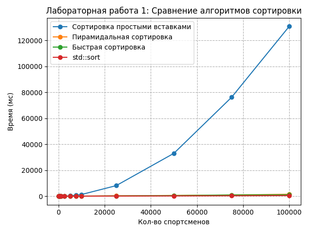

# Лабораторная работа 1: Алгоритмы сортировок

## Общее задание

1) Реализовать на языке C++ программирования сортировки для массива объектов в  соответствии с вариантом. 
2) Перегрузить операторы сравнения (>, <, >=, <=) для сравнения  объектов. Правила сравнения указаны в варианте.
3) Входные данные для сортировки массива обязательно считывать из  внешних источников: текстовый файл, файлы csv, xlsx, данные из СУБД (любое на выбор). Выходные данные (отсортированный массив) записывать в файл.
4) Выбрать 10-20 наборов данных для сортировки размерности от 100 и  более (но не менее, чем до 100000). Засечь (программно) время сортировки  каждым алгоритмом и std::sort. По полученным точкам построить графики  зависимости времени сортировки от размерности массива для каждого из алгоритмов сортировки на одной оси координат. Сделать выводы о  том, в каком случае, какой из методов лучше применять.
5) Сделать отчет, состоящий из:
- документации к коду работы, сгенерированную с помощью case средства (doxygen, sphinx, etc);
- ссылку на исходный код программы в репозитории;
- графики времени сортировок. 

# Вариант 7

**Данные:** Массив данных о сборной олимпийской команде: ФИО,  возраст, рост, вес, вид спорта (сравнение по полям – вид  спорта, ФИО, возраст)

**Алгоритмы сортировок:** 
- в) Сортировка простыми вставками 
- д) Пирамидальная сортировка 
- е) Быстрая сортировка 

# Исходный код

Компилируется с помощью `make build`, скомпилированная программа попадает в `./bin/main`. Запускается с помощью `make run`. Сами исходники лежат в [./src](./src/)

# Документация

Генерируется с помощью `make docs`
- [Doxyfile](./Doxyfile)
- [docs.pdf](./docs.pdf)

# Тестирование

Тестирование происходит на Python в три этапа:
1) `make generate` - запускает скрипт [generate.py](./tests/generate.py), который генерирует CSV-файлы разных размеров в ./tests/generated
2) `make test` - запускает скрипт [test.py](./tests/test.py), который запускает ./bin/main на тестах и записывает результат в [results.csv](./tests/results.csv)
3) `make plot` - запускает скрипт [plot.py](./tests/plot.py), который отображает график на экране и сохраняет его в [sorting_performance.png](./sorting_performance.png)

# Отчет

Отчет генерируется из ссылки на репозиторий, графика и документации скриптом [report.py](./tests/report.py) и сохраняется в [report.pdf](./report.pdf)
