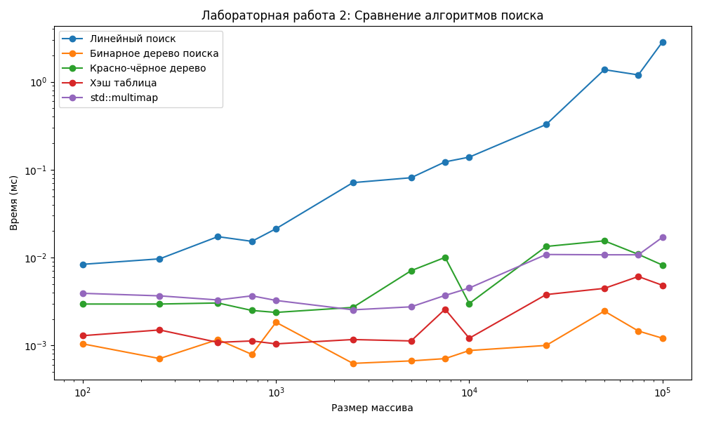
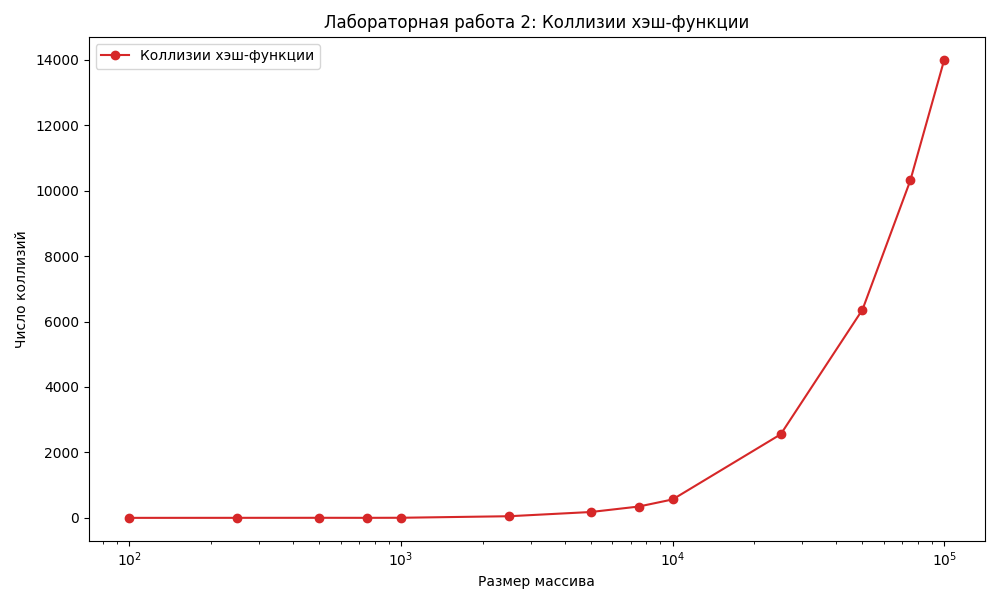

# Лабораторная работа 2: Алгоритмы поиска данных

## Общее задание

1) Реализовать поиск заданного элемента в массиве (необходимо найти ВСЕ вхождения) объектов по ключу в соответствии с вариантом (структурой данных из ЛР1, ключом является  первое НЕ числовое поле объекта) следующими методами:
- линейный поиск
- с помощью бинарного дерева поиска
- с помощью красно-черного дерева
- с помощью хэш таблицы

Все методы необходимо реализовать самостоятельно.

**Предполагается, что в исходном массиве данных ключи не уникальны.**

2) Для хэш таблицы необходимо реализовать хэш функцию и метод разрешения коллизий. Подсчитать число коллизий хэш функции и построить график зависимости от размерности массива.
3) Выполнить поиск не менее 10 раз на массивах разных размерностей от 100 до 1000000. Засечь (программно) время поиска для  всех способов. По полученным точкам  построить сравнительные графики зависимости времени поиска от размерности  массива.
4) Записать входные данные в ассоциативный массив multimap<key,  object> и сравнить время поиска по ключу в нем с временем поиска из  п.3. Добавить данные по времени поиска в ассоциативном массиве в  общее сравнение с остальными способами и построить график  зависимости времени поиска от размерности массива.
5) Требования к отчету аналогичны работе 1.

# Вариант 7

**Данные:** Массив данных о сборной олимпийской команде: ФИО,  возраст, рост, вес, вид спорта (сравнение по полям – вид  спорта, ФИО, возраст)

**Алгоритмы поиска:**
- Линейный поиск
- Бинарное дерево поиска
- Красно-чёрное дерево
- Хэш-таблица (разрешение коллизий методом цепочек)
- `std::multimap`

# Исходный код

Компилируется с помощью `make build`, скомпилированная программа попадает в `./bin/main`. Сами исходники лежат в [./src](./src/)

# Документация

Генерируется с помощью `make docs`
- [Doxyfile](./Doxyfile)
- [docs.pdf](./docs.pdf)

# Тестирование

Тестирование происходит на Python в три этапа:
1) `make generate` - запускает скрипт [generate.py](./tests/generate.py), который генерирует CSV-файлы разных размеров в ./tests/generated
2) `make test` - запускает скрипт [test.py](./tests/test.py), который запускает ./bin/main на тестах и записывает результат в [results/results.csv](./tests/results/results.csv)
3) `make plot` - запускает скрипт [plot.py](./tests/plot.py), который отображает графики на экране и сохраняет их в [tests/results/](./tests/results/)

# Отчет

Отчет генерируется из ссылки на репозиторий, [README.md](./README.md), графиков и документации скриптом [report.py](./tests/report.py) и сохраняется в [report.pdf](./report.pdf)
